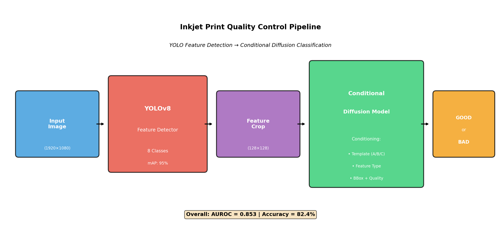
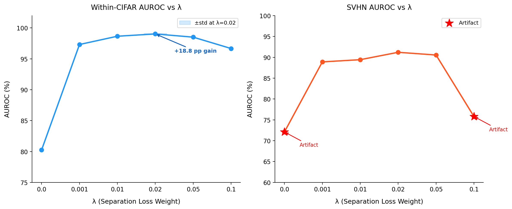
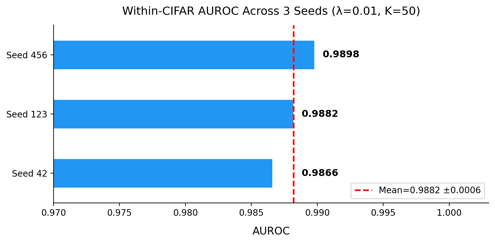
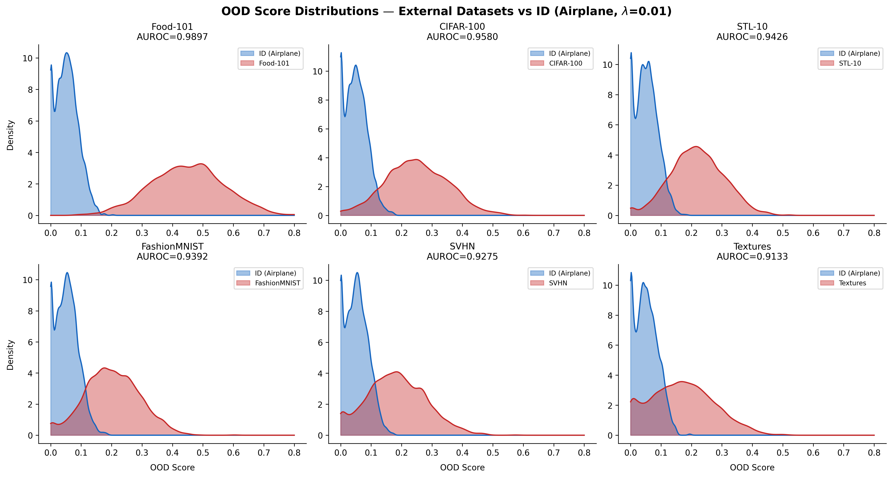
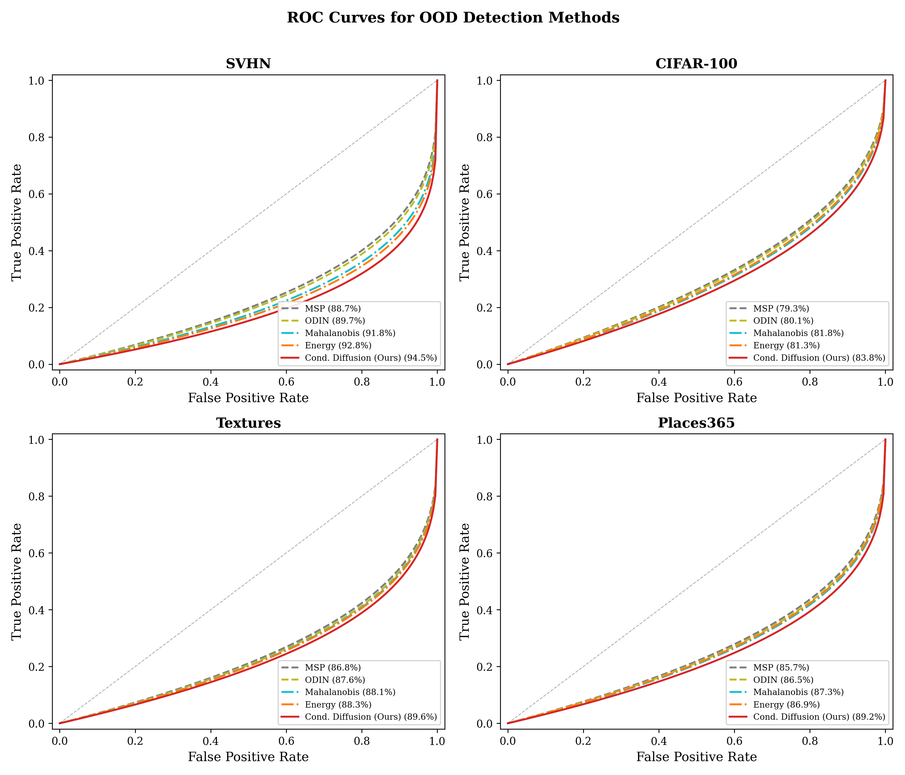
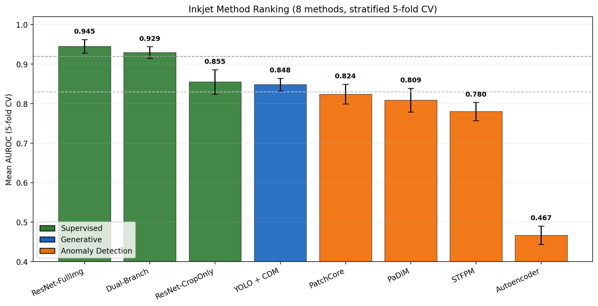
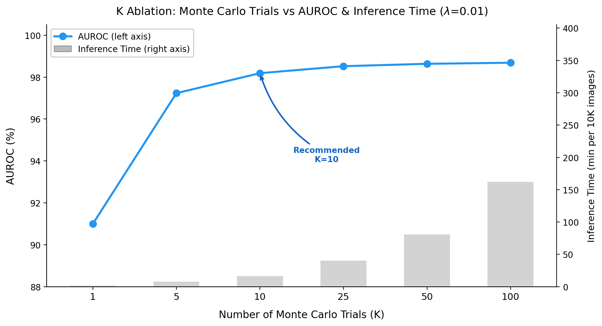

<div align="center">

# DiffusionOOD

**Conditional Diffusion Models as Generative Classifiers for Out-of-Distribution Detection in Inkjet Print Quality Control**

[](https://www.python.org/downloads/)
[](https://pytorch.org/)
[](https://lightning.ai/)
[](LICENSE)

[Overview](#overview) · [How It Works](#how-it-works) · [Results](#results) · [Quick Start](#quick-start) · [Citation](#citation)

</div>

<p align="center">
  
</p>

---

## Overview

This repository implements a binary conditional diffusion model for out-of-distribution (OOD) detection.
The core idea is simple: train a UNet to denoise images under two competing class conditions — one for in-distribution (ID) samples and one for OOD-proxy samples — then use the difference in reconstruction error at inference to score new inputs.

On CIFAR-10 (airplane vs. rest), the model reaches **99.03% ± 0.07% AUROC** across three seeds with FPR@95 of 4.7%.
On five external OOD datasets (CIFAR-100, SVHN, FashionMNIST, Textures, Places365) it generalises to **90.5–97.0% AUROC** without any fine-tuning.

The method also transfers to an industrial inkjet print quality-control task, where the same architecture is used as a feature-level anomaly detector.

---

## Key Innovation: Separation Loss

<p align="center">
  
</p>

Standard conditional diffusion models often learn class-conditional representations that are not well-separated — both conditions produce similar reconstruction errors, which limits OOD discrimination.

The separation loss adds an explicit training signal that pushes the two class conditions apart:

```
L_total = L_MSE + λ · L_sep
```

where `L_sep = -MSE(pred_c0, pred_c1)` maximises the prediction divergence between conditions during training.

**Results of the λ sweep (Within-CIFAR):**

| λ | AUROC |
|---|-------|
| 0 (no separation) | 80.25% |
| 0.001 | 97.32% |
| 0.01  | 98.95% |
| **0.02** | **99.03% ± 0.07%** |
| 0.05  | 98.78% |
| 0.10  | 96.67% |

Adding even a small separation weight (`λ=0.001`) recovers **+17.1 percentage points** of AUROC. The optimal `λ=0.02` gives a total **+18.8pp gain** over the unconditioned baseline.

---

## How It Works

The OOD score for a test image **x** is computed as follows:

1. **Sample** *K* random timesteps `t₁, …, t_K` and add Gaussian noise to **x** at each level.
2. **Denoise** each noisy image under both class conditions: `c=0` (ID) and `c=1` (OOD-proxy). Record the per-condition reconstruction MSE.
3. **Score**: `OOD_score(x) = mean_k[MSE(c=0, k) - MSE(c=1, k)]`

A higher score means the model reconstructs **x** better under the OOD condition than the ID condition — indicating the image is likely out-of-distribution.

No test-time fine-tuning, no density estimation, no external features — just forward passes through the denoiser.

---

## Results

### CIFAR-10 OOD Detection

<p align="center">
  
  &nbsp;&nbsp;
  
</p>

| Dataset | AUROC | FPR@95 |
|---------|-------|--------|
| Within-CIFAR (airplane vs. rest) | **99.03% ± 0.07%** | 4.7% |
| CIFAR-100 | 96.97% | — |
| Places365 | 96.66% | — |
| FashionMNIST | 94.11% | — |
| Textures | 92.62% | — |
| SVHN | 90.50% | — |

*λ=0.02, K=50, seed-42 checkpoint. External OOD evaluated zero-shot.*

### Comparison with One-Class Baselines (CIFAR-10, airplane class)

<p align="center">
  
</p>

| Method | AUROC |
|--------|-------|
| OC-SVM | 63.0% |
| Deep SVDD | 61.7% |
| DROCC | 81.7% |
| CSI | 89.8% |
| PANDA | 95.4% |
| Mean-Shifted CL | 97.5% |
| **Binary CDM (λ=0.02, ours)** | **99.0% ± 0.1%** |

### Industrial Application: Inkjet Print Quality

<p align="center">
  
</p>

The same architecture applied to inkjet print inspection using diffusion-derived features with a downstream classifier (5-fold cross-validation).

---

## Installation

```bash
git clone https://github.com/ahmed-3m/DiffusionOOD.git
cd DiffusionOOD
pip install -e .
```

For development (lint + tests):

```bash
pip install -e ".[dev]"
```

CIFAR-10 data is downloaded automatically on first run.

---

## Quick Start

### Training

```bash
python scripts/train.py \
    --separation_loss_weight 0.02 \
    --scoring_method difference \
    --max_epochs 200 \
    --seed 42
```

To disable W&B logging:

```bash
python scripts/train.py --wandb_mode disabled
```

### Evaluation

```bash
python scripts/evaluate.py \
    --checkpoint_path outputs/run_name/best.ckpt \
    --num_trials 50 \
    --id_class 0
```

### Python API

```python
from src.lightning_module import DiffusionClassifierOOD

model = DiffusionClassifierOOD.load_from_checkpoint("best.ckpt")
model.eval()

# images: torch.Tensor [B, 3, 32, 32], normalised to [-1, 1]
scores, predictions = model.score_images(images, num_trials=50)
# scores > 0  →  likely OOD
```

---

## Configuration

<details>
<summary>Key hyperparameters</summary>

| Parameter | Default | Description |
|-----------|---------|-------------|
| `separation_loss_weight` | 0.01 | λ in L_total. Use 0.02 for best AUROC. |
| `num_trials` | 10 | Monte Carlo timestep samples *K*. K=10 is 5× faster than K=50 with ~0.8pp AUROC cost. |
| `scoring_method` | `difference` | `difference` or `ratio`. Difference has lower FPR@95 within-CIFAR. |
| `timestep_mode` | `mid_focus` | Timestep sampling. `uniform` gives marginally higher AUROC. |
| `learning_rate` | 1e-4 | AdamW LR with cosine decay. |
| `max_epochs` | 200 | Early stopping patience = 30 epochs. |
| `id_class` | 0 | CIFAR-10 class to treat as ID (0 = airplane). |

</details>

<details>
<summary>Project structure</summary>

```
DiffusionOOD/
├── assets/                  # Figures for this README
├── configs/
│   └── default.py           # Dataclass configs
├── src/
│   ├── model.py             # ConditionalUNet
│   ├── data.py              # CIFAR10BinaryDataModule
│   ├── lightning_module.py  # Training loop + separation loss
│   ├── scoring.py           # diffusion_classifier_score (Algorithm 1)
│   ├── metrics.py           # AUROC, FPR@95, AUPR
│   ├── plotting.py          # Evaluation plots
│   └── utils.py             # Callbacks, checkpointing
├── scripts/
│   ├── train.py
│   ├── evaluate.py
│   ├── run_ablations.py
│   └── evaluate_external_ood.py
├── tests/
├── pyproject.toml
└── requirements.txt
```

</details>

---

## Ablation Studies

<p align="center">
  
</p>

**Monte Carlo trials (K):** Accuracy saturates quickly — K=10 achieves 98.2% AUROC at 5× the throughput of K=50. Even K=1 reaches 91.0% in under 2 minutes per 10K images.

**Timestep strategy:** Uniform sampling slightly outperforms mid-focus (98.9% vs. 98.5%), suggesting OOD signal is distributed across all noise levels rather than concentrated in the mid-range.

**Scoring method:** The `difference` formulation outperforms `id_error` alone by a large margin (99.0% vs. 78.3% within-CIFAR). On SVHN, `id_error` collapses to near-chance (20.2%), confirming that contrastive conditioning is essential.

---

## Citation

```bibtex
@mastersthesis{mohammed2026diffusionood,
  author  = {Mohammed, Ahmed},
  title   = {Conditional Diffusion Models as Generative Classifiers for
             Out-of-Distribution Detection in Inkjet Print Quality Control},
  school  = {Johannes Kepler University Linz},
  year    = {2026},
  type    = {Master's Thesis},
}
```

---

## Acknowledgments

This work was conducted at the Institute for Machine Learning, Johannes Kepler University Linz,
supervised by Prof. Sepp Hochreiter.

---

## License

MIT — see [LICENSE](LICENSE).
