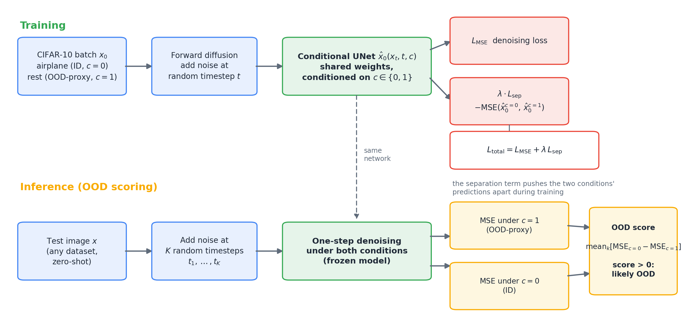
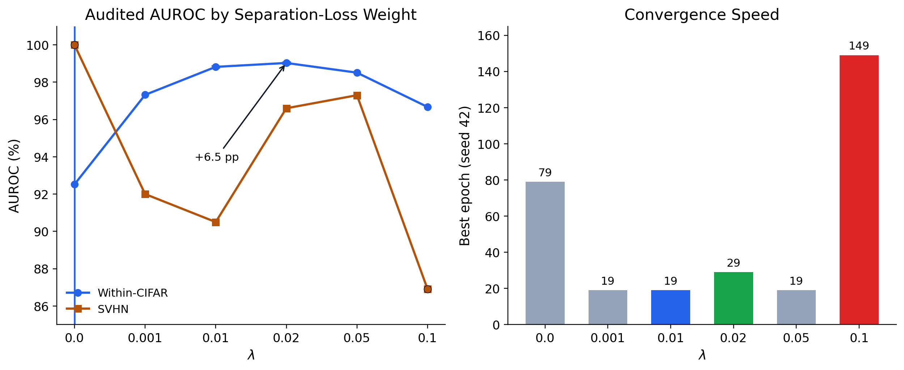
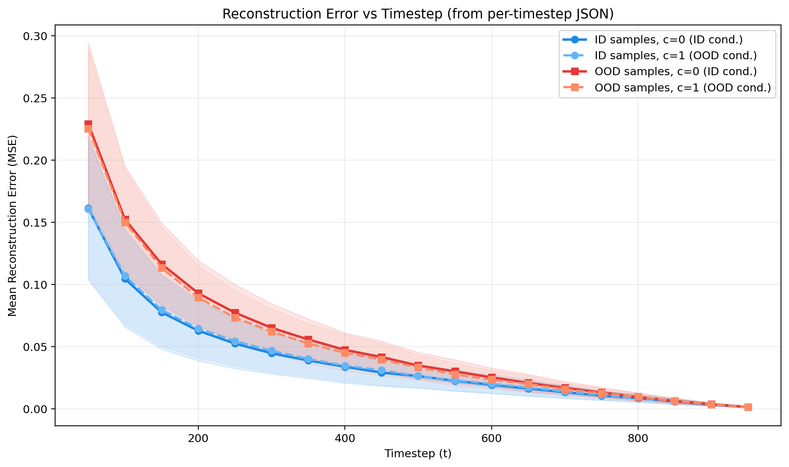
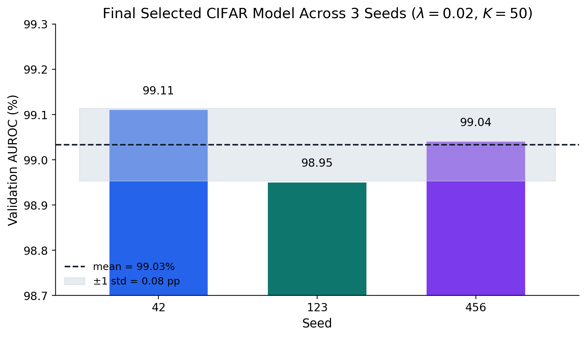
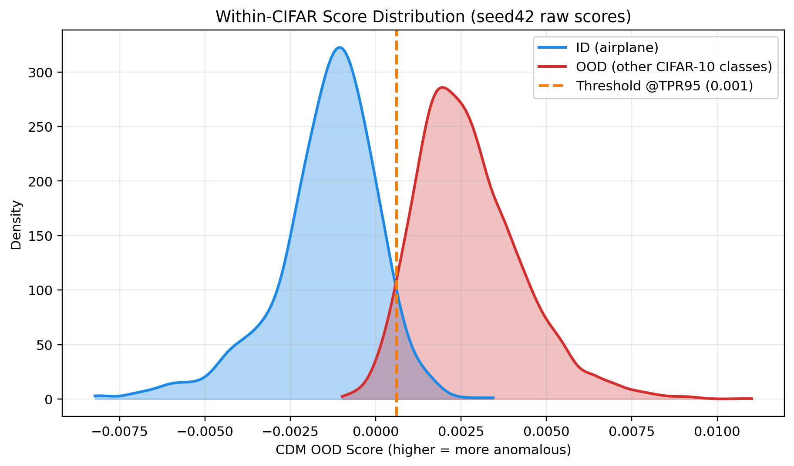
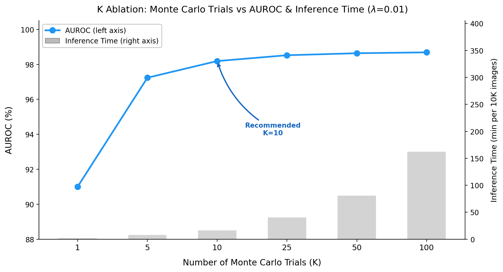
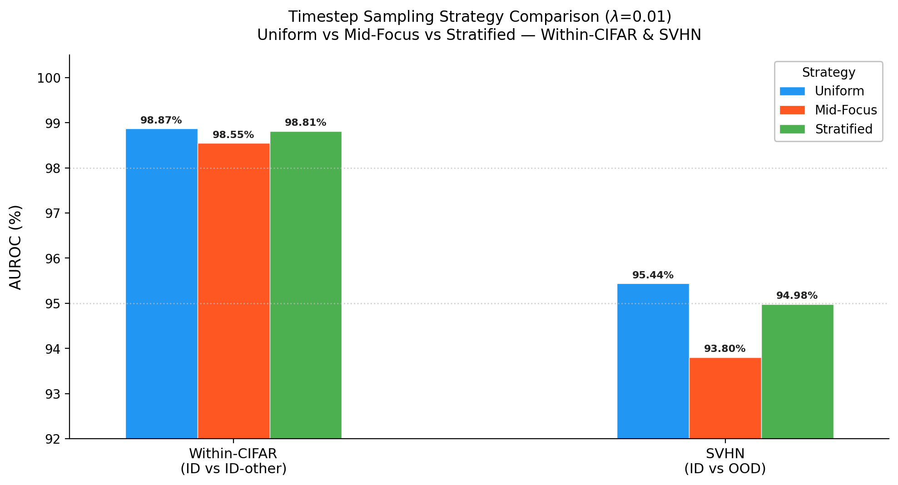
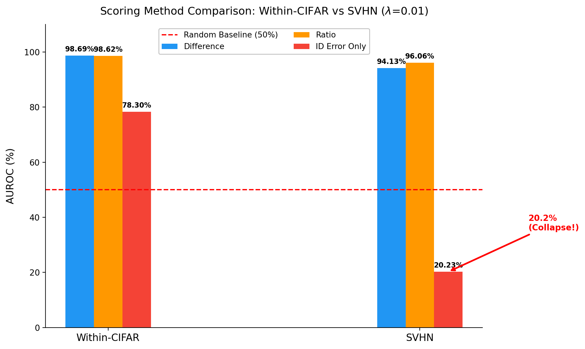

<div align="center">

# DiffusionOOD

**Conditional Diffusion Models for Out-of-Distribution Detection**

[](https://github.com/ahmed-3m/DiffusionOOD/actions/workflows/ci.yml)
[](https://www.python.org/downloads/)
[](https://pytorch.org/)
[](https://lightning.ai/)
[](LICENSE)

Code for the CIFAR-10 track of my Master's thesis at JKU Linz.

[Overview](#overview) · [Separation Loss](#key-innovation-separation-loss) · [Method](#method) · [Results](#results) · [Ablations](#ablation-studies) · [Quick Start](#quick-start) · [Citation](#citation)

</div>

<p align="center">
  
</p>

---

## Overview

This repository implements a binary conditional diffusion model for out-of-distribution (OOD) detection.
The core idea is simple: train a UNet to denoise images under two competing class conditions — one for
in-distribution (ID) samples and one for OOD-proxy samples — then use the difference in reconstruction
error at inference to score new inputs.

**Highlights** (all numbers reproducible from the retained artefacts):

- **99.03% ± 0.07% AUROC** within-CIFAR (airplane vs. rest, λ=0.02, three seeds, K=50)
- Separation loss lifts the three-seed mean by **+6.5 pp** (92.52% → 99.03%) and collapses the seed
  spread from **±11.07 to ±0.07**
- Independently auditable seed-42 artefact: **98.98% AUROC, 4.7% FPR@95, 99.87 AUPR** (K=100)
- **Zero-shot** transfer to five external OOD datasets: **90.50–96.97% AUROC** (mean 94.17%)
- K=10 scoring runs ~5× faster than K=50 while still reaching 98.2% AUROC

The same conditional-diffusion scoring idea was also applied to an industrial inkjet print
quality-control task; that second track lives in the companion repository
[InkjetOOD](https://github.com/ahmed-3m/InkjetOOD).

---

## Key Innovation: Separation Loss

<p align="center">
  
</p>

Standard conditional diffusion models often learn class-conditional representations that are not
well-separated — both conditions produce similar reconstruction errors, which limits OOD
discrimination.

The separation loss adds an explicit training signal that pushes the two class conditions apart:

```
L_total = L_MSE + λ · L_sep
```

where `L_sep = -MSE(pred_c0, pred_c1)` maximises the prediction divergence between conditions
during training.

**λ sweep (Within-CIFAR AUROC, three-seed mean ± std for λ ∈ {0, 0.01, 0.02}, seed-42 otherwise):**

| λ | Within-CIFAR AUROC | Best epoch (seed 42) | SVHN AUROC |
|---|---|---|---|
| 0 (no separation) | 92.52% ± 11.07% | 79 | 100.0% † |
| 0.001 | 97.32% | 19 | 92.0% |
| 0.01 | 98.82% ± 0.06% | 19 | 90.5% |
| **0.02** | **99.03% ± 0.07%** | 29 | 96.6% |
| 0.05 | 98.51% | 19 | 97.3% |
| 0.10 | 96.67% | 149 | 86.9% † |

† Documented artefact points kept for traceability: the λ=0 SVHN value (100%) stems from a
scoring-direction artefact on degenerate near-zero difference scores.

The stability story is the point. Without separation, the three seeds land at 79.73%, 98.81% and
99.01% — conditioning alone works for some seeds and fails for others. With λ=0.02 the seeds land at
99.11%, 98.95% and 99.04%: the mean rises by +6.5 pp and the variance effectively disappears.
At λ=0.10 the separation objective starts to dominate the denoising loss (96.67%, unusually late
convergence at epoch 149).

---

## Method

The OOD score for a test image **x** is computed as follows:

1. **Sample** *K* random timesteps `t₁ … t_K` and add Gaussian noise to **x** at each level.
2. **Denoise** each noisy image under both class conditions: `c=0` (ID) and `c=1` (OOD-proxy).
   Record the per-condition reconstruction MSE.
3. **Score**: `OOD_score(x) = mean_k [ MSE(c=0, k) − MSE(c=1, k) ]`

A higher score means the model reconstructs **x** better under the OOD condition than under the ID
condition — indicating the image is likely out-of-distribution.

<p align="center">
  
</p>

The per-timestep view shows where the signal lives: mean reconstruction error as a function of
timestep *t* for ID and OOD samples under both conditions (shaded bands: one standard deviation).
The gap between the `c=0` and `c=1` curves is what the score aggregates across timesteps.

No test-time fine-tuning, no density estimation, no external features — just forward passes
through the denoiser.

---

## Results

### CIFAR-10 OOD Detection

<p align="center">
  
  &nbsp;&nbsp;
  
</p>

*Left: validation AUROC across training seeds (42/123/456) from checkpoint metadata — a stability
summary; core quantitative claims come from the reproducible raw-score evaluation in the table.
Right: Within-CIFAR score distribution with the operating threshold selected at TPR = 95%
(FPR@95 = 4.7%).*

| Dataset | Type | AUROC | FPR@95 | AUPR |
|---|---|---|---|---|
| Within-CIFAR (three-seed selected model, λ=0.02, K=50) | — | **99.03% ± 0.07%** | — | — |
| Within-CIFAR (airplane vs. rest, auditable seed-42 artefact, K=100) | Within | **98.98%** | 4.7% | 99.87% |
| CIFAR-100 | Near OOD | 96.97% | 14.8% | 99.65% |
| Places365 | Far OOD | 96.50% | 15.4% | 99.57% |
| FashionMNIST | Far OOD | 94.03% | 20.5% | 99.16% |
| Textures (DTD) | Far OOD | 92.84% | 30.1% | 95.97% |
| SVHN | Far OOD | 90.50% | 27.0% | 99.38% |

*External datasets are evaluated zero-shot against the full CIFAR-10 test reference pool
(seed-42, λ=0.02, K=100, difference scoring); the three-seed row reports the selected λ=0.02
model at K=50.*

### Comparison with One-Class Baselines (CIFAR-10, airplane class)

| Method | Type | AUROC |
|---|---|---|
| OC-SVM (raw pixels) | One-class | 63.0% |
| Deep SVDD | One-class | 61.7% |
| DROCC | One-class | 81.7% |
| CSI | Contrastive | 89.8% |
| PANDA | Pretrained + OC | 95.4% |
| Mean-Shifted C.L. | Contrastive | 97.5% |
| Binary CDM (λ=0, ours) | Generative | 92.52% ± 11.07% |
| **Binary CDM (λ=0.02, ours)** | Generative + sep. loss | **99.03% ± 0.07%** |

*Baseline values are the numbers published by the original papers (or as reproduced by the PANDA
paper) under the same one-vs-rest protocol. The comparison is asymmetric: the CDM is trained with
an OOD-proxy class, whereas the one-class baselines see only ID samples.*

### Industrial application

The same scoring idea was applied to industrial inkjet print quality control: YOLOv8 localises
eight print features on experimental prints, and a crop-level conditional diffusion model scores
each crop (stratified 5-fold cross-validation on the FTI_Zer0P dataset from PROFACTOR GmbH).
Code, dataset documentation and results for that track — including the cross-domain analysis of
where separation loss does and does not help — live in the companion repository
**[InkjetOOD](https://github.com/ahmed-3m/InkjetOOD)**.

---

## Installation

```bash
git clone https://github.com/ahmed-3m/DiffusionOOD.git
cd DiffusionOOD
pip install -e .
```

For development (lint + tests):

```bash
pip install -e ".[dev]"
```

CIFAR-10 data is downloaded automatically on first run.

---

## Quick Start

### Training

```bash
python scripts/train.py \
    --separation_loss_weight 0.02 \
    --scoring_method difference \
    --max_epochs 200 \
    --seed 42
```

To disable W&B logging:

```bash
python scripts/train.py --wandb_mode disabled
```

### Evaluation

```bash
python scripts/evaluate.py \
    --checkpoint_path outputs/run_name/best.ckpt \
    --num_trials 100 \
    --id_class 0
```

External OOD benchmarks are evaluated from a saved evaluation results directory:

```bash
python scripts/evaluate_external_ood.py \
    --results_dir eval_results/run_name \
    --num_trials 100
```

### Python API

```python
from src.lightning_module import DiffusionClassifierOOD

model = DiffusionClassifierOOD.load_from_checkpoint("best.ckpt")
model.eval()

# images: torch.Tensor [B, 3, 32, 32], normalised to [-1, 1]
scores, predictions = model.score_images(images, num_trials=50)
# scores > 0  →  likely OOD
```

---

## Configuration

<details>
<summary>Key hyperparameters</summary>

| Parameter | Default | Description |
|-----------|---------|-------------|
| `separation_loss_weight` | 0.01 | λ in L_total. Use 0.02 for best AUROC. |
| `num_trials` | 10 | Monte Carlo timestep samples *K*. K=10 is 5× faster than K=50 with ~0.8pp AUROC cost. |
| `scoring_method` | `difference` | `difference` or `ratio`. Difference has lower FPR@95 within-CIFAR. |
| `timestep_mode` | `mid_focus` | Timestep sampling. `uniform` gives marginally higher AUROC. |
| `learning_rate` | 1e-4 | AdamW LR with cosine decay. |
| `max_epochs` | 200 | Early stopping patience = 30 epochs. |
| `id_class` | 0 | CIFAR-10 class to treat as ID (0 = airplane). |

</details>

<details>
<summary>Project structure</summary>

```
DiffusionOOD/
├── assets/                  # Figures for this README
├── configs/
│   └── default.py           # Dataclass configs
├── src/
│   ├── model.py             # ConditionalUNet
│   ├── data.py              # CIFAR10BinaryDataModule
│   ├── lightning_module.py  # Training loop + separation loss
│   ├── scoring.py           # diffusion_classifier_score (Algorithm 1)
│   ├── metrics.py           # AUROC, FPR@95, AUPR
│   ├── plotting.py          # Evaluation plots
│   └── utils.py             # Callbacks, checkpointing
├── scripts/
│   ├── train.py
│   ├── evaluate.py
│   ├── run_ablations.py
│   └── evaluate_external_ood.py
├── tests/
├── pyproject.toml
└── requirements.txt
```

</details>

---

## Ablation Studies

### Monte Carlo trials (K)

<p align="center">
  
</p>

Accuracy saturates quickly — K=10 achieves 98.2% AUROC at 5× the throughput of K=50, and the curve
flattens after K=25. Even K=1 reaches 91.0% in under 2 minutes per 10K images.

### Timestep sampling strategy

<p align="center">
  
</p>

Uniform sampling is best (Within-CIFAR 98.9%, SVHN 95.4%), stratified sampling is equivalent, and
mid-focus underperforms on both datasets (98.5% / 93.8%) — suggesting the OOD signal is distributed
across noise levels rather than concentrated in the mid-range.

### Scoring method

<p align="center">
  
</p>

Difference and ratio scoring both perform well, while ID-error-only scoring degrades severely:
78.3% within-CIFAR and a near-chance collapse on SVHN (20.2%). Contrastive conditioning — scoring
against *both* conditions — is essential.

---

## Citation

```bibtex
@mastersthesis{mohammed2026diffusionood,
  author  = {Mohammed, Ahmed},
  title   = {Conditional Diffusion Models as Generative Classifiers for
             Out-of-Distribution Detection},
  school  = {Johannes Kepler University Linz},
  year    = {2026},
  type    = {Master's Thesis},
}
```

---

## Acknowledgments

This work was conducted at the Institute for Machine Learning, Johannes Kepler University Linz,
supervised by Prof. Sepp Hochreiter, with Claus Hofmann, MSc as assistant supervisor, and in
cooperation with PROFACTOR GmbH (Steyr, Austria). Supported by the Government of Upper Austria
(project Zer0P).

---

## License

MIT — see [LICENSE](LICENSE).
